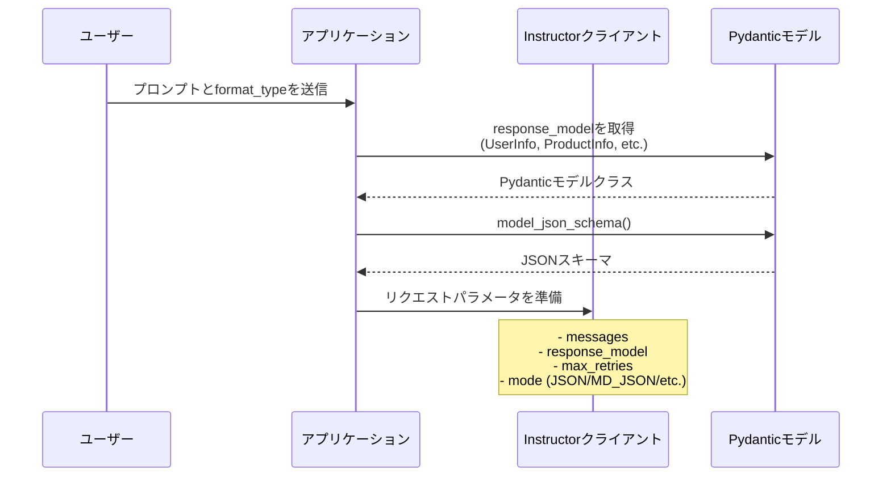
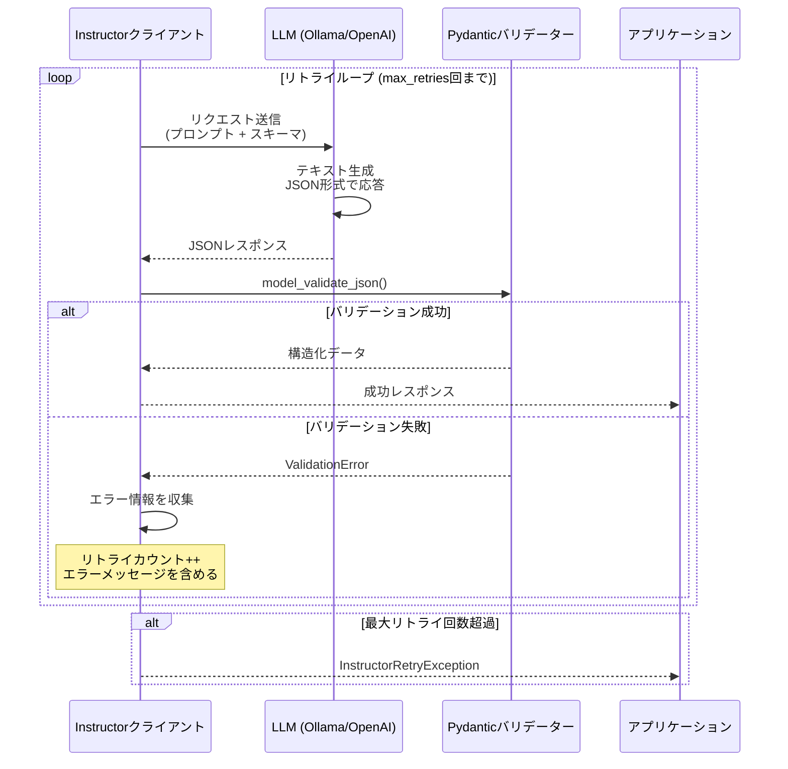

# Instructor フレームワーク フローダイアグラム

このドキュメントでは、Instructorフレームワークを使用したLLMへのリクエスト、バリデーション、リトライの全体フローを視覚化します。

## 概要

Instructorフレームワークは、LLMから構造化された出力を取得するためのPythonライブラリです。Pydanticモデルを使用してスキーマを定義し、自動的にバリデーションとリトライを行います。

## フロー全体像

```mermaid
flowchart TD
    Start([開始]) --> UserInput[ユーザーがプロンプトと<br/>response_modelを指定]
    UserInput --> InstructorPatch[Instructorクライアント初期化<br/>instructor.from_openai/from_provider]

    InstructorPatch --> SchemaGen[Pydanticモデルから<br/>JSONスキーマを生成]
    SchemaGen --> PrepareRequest[LLMリクエストを準備<br/>- プロンプト<br/>- スキーマ情報<br/>- システムメッセージ]

    PrepareRequest --> SendRequest[LLMにリクエスト送信]
    SendRequest --> LLMProcess[LLMがプロンプトを処理<br/>JSON形式で応答生成]

    LLMProcess --> ReceiveResponse[JSONレスポンス受信]
    ReceiveResponse --> ParseJSON[JSON文字列をパース]

    ParseJSON --> ValidateData{Pydanticバリデーション}

    ValidateData -->|成功| TypeCheck{型チェック}
    ValidateData -->|失敗| ValidationError[バリデーションエラー検出<br/>- 必須フィールド欠落<br/>- 型不一致<br/>- 制約違反]

    TypeCheck -->|成功| CustomValidation{カスタムバリデーション<br/>@field_validator}
    TypeCheck -->|失敗| ValidationError

    CustomValidation -->|成功| StructuredData[構造化データ生成<br/>Pydanticモデルインスタンス]
    CustomValidation -->|失敗| ValidationError

    ValidationError --> CheckRetry{リトライ回数<br/>< max_retries?}

    CheckRetry -->|Yes| PrepareRetry[リトライリクエストを準備<br/>- 元のプロンプト<br/>- エラー情報<br/>- 修正指示]
    CheckRetry -->|No| RaiseException[例外を発生<br/>ValidationError/<br/>InstructorRetryException]

    PrepareRetry --> SendRequest

    StructuredData --> Return([構造化データを返す])
    RaiseException --> HandleError[エラーハンドリング<br/>ユーザーに通知]

    HandleError --> End([終了])
    Return --> End

    style Start fill:#90EE90
    style End fill:#FFB6C1
    style LLMProcess fill:#87CEEB
    style ValidateData fill:#FFD700
    style CheckRetry fill:#FFD700
    style ValidationError fill:#FF6B6B
    style StructuredData fill:#90EE90
    style RaiseException fill:#FF6B6B
```

## 詳細フロー図

### 1. リクエスト準備フェーズ



### 2. LLMリクエストとバリデーションフェーズ



### 3. バリデーション詳細フロー

```mermaid
flowchart TD
    Input[JSONレスポンス受信] --> Parse[JSON文字列パース]

    Parse --> RequiredFields{必須フィールド<br/>すべて存在?}
    RequiredFields -->|No| Error1[MissingFieldError]
    RequiredFields -->|Yes| TypeValidation{型が正しい?}

    TypeValidation -->|No| Error2[TypeError]
    TypeValidation -->|Yes| ConstraintCheck{制約を満たす?<br/>ge, le, max_length, etc.}

    ConstraintCheck -->|No| Error3[ValidationError]
    ConstraintCheck -->|Yes| CustomValidator{カスタムバリデーター<br/>@field_validator}

    CustomValidator -->|失敗| Error4[CustomValidationError]
    CustomValidator -->|成功| ModelValidator{モデルバリデーター<br/>@model_validator}

    ModelValidator -->|失敗| Error5[ModelValidationError]
    ModelValidator -->|成功| Success[バリデーション成功]

    Error1 --> Collect[エラー情報を収集]
    Error2 --> Collect
    Error3 --> Collect
    Error4 --> Collect
    Error5 --> Collect

    Collect --> PrepareRetry[リトライメッセージ準備<br/>エラー詳細を含める]

    Success --> Return([Pydanticモデル<br/>インスタンスを返す])
    PrepareRetry --> CheckRetries{リトライ回数<br/>チェック}

    style Error1 fill:#FF6B6B
    style Error2 fill:#FF6B6B
    style Error3 fill:#FF6B6B
    style Error4 fill:#FF6B6B
    style Error5 fill:#FF6B6B
    style Success fill:#90EE90
```

## 実装例

### Pydanticモデルの定義

```python
from pydantic import BaseModel, Field, field_validator

class UserInfo(BaseModel):
    """ユーザー情報を表す構造化モデル"""
    name: str = Field(description="ユーザーの名前")
    age: int = Field(description="ユーザーの年齢", ge=0, le=150)
    email: Optional[str] = Field(default=None, description="メールアドレス")

    @field_validator('email')
    @classmethod
    def validate_email(cls, v):
        if v and '@' not in v:
            raise ValueError('有効なメールアドレスではありません')
        return v
```

### Instructorクライアントの使用

```python
import instructor
from openai import OpenAI

# クライアント初期化
client = instructor.from_openai(OpenAI())

# 構造化出力を取得
user = client.chat.completions.create(
    model="gpt-4",
    response_model=UserInfo,
    messages=[
        {"role": "user", "content": "田中太郎は35歳です"}
    ],
    max_retries=3  # 最大3回リトライ
)

print(user.name)  # "田中太郎"
print(user.age)   # 35
```

## リトライメカニズムの詳細

### リトライ時のプロンプト例

初回リクエスト:
```
ユーザー: 田中太郎は35歳です
システム: 以下のスキーマでJSON出力してください: {...}
```

バリデーション失敗後のリトライ:
```
ユーザー: 田中太郎は35歳です
システム: 前回の応答にエラーがありました:
- フィールド 'email' が必須ですが提供されていません
- 再度、正しいスキーマで出力してください: {...}
```

## モード設定

Instructorは複数のモードをサポートしています:

| モード | 説明 | 用途 |
|--------|------|------|
| `JSON` | 標準JSON形式 | 最も一般的 |
| `MD_JSON` | Markdownコードブロック内のJSON | GPT-4など |
| `TOOLS` | Function Calling | OpenAI Tools API |
| `PARALLEL_TOOLS` | 並列ツール呼び出し | 複数の構造化出力 |

```python
client = instructor.from_openai(
    client,
    mode=instructor.Mode.JSON
)
```

## エラーハンドリング

```python
from instructor.exceptions import InstructorRetryException
from pydantic import ValidationError

try:
    user = client.chat.completions.create(
        response_model=UserInfo,
        messages=[...],
        max_retries=3
    )
except ValidationError as e:
    print(f"バリデーションエラー: {e}")
except InstructorRetryException as e:
    print(f"最大リトライ回数超過: {e}")
```

## パフォーマンス最適化

1. **適切なmax_retries設定**: 通常は2-3回で十分
2. **明確なスキーマ定義**: Field()のdescriptionを詳細に記述
3. **シンプルなモデル**: 複雑すぎるネストは避ける
4. **ストリーミング対応**: 大きな出力の場合は部分的に処理

```python
# ストリーミング例
for partial_user in client.chat.completions.create_partial(
    response_model=UserInfo,
    messages=[...],
    stream=True
):
    print(partial_user)  # 部分的な結果を逐次取得
```

## まとめ

Instructorフレームワークの主な利点:

1. ✅ **型安全性**: Pydanticによる厳密な型チェック
2. ✅ **自動リトライ**: バリデーション失敗時の自動再試行
3. ✅ **マルチプロバイダー**: OpenAI, Anthropic, Ollama等に対応
4. ✅ **エラーハンドリング**: 詳細なエラー情報とフィードバック
5. ✅ **ストリーミング**: 大規模データの効率的な処理

これにより、LLMからの出力を確実に構造化し、アプリケーションで安全に使用できます。

## 参考資料

- [Instructor公式ドキュメント](https://python.useinstructor.com/)
- [Pydanticバリデーション](https://docs.pydantic.dev/latest/concepts/validators/)
- [リトライメカニズム](https://python.useinstructor.com/concepts/retrying/)
